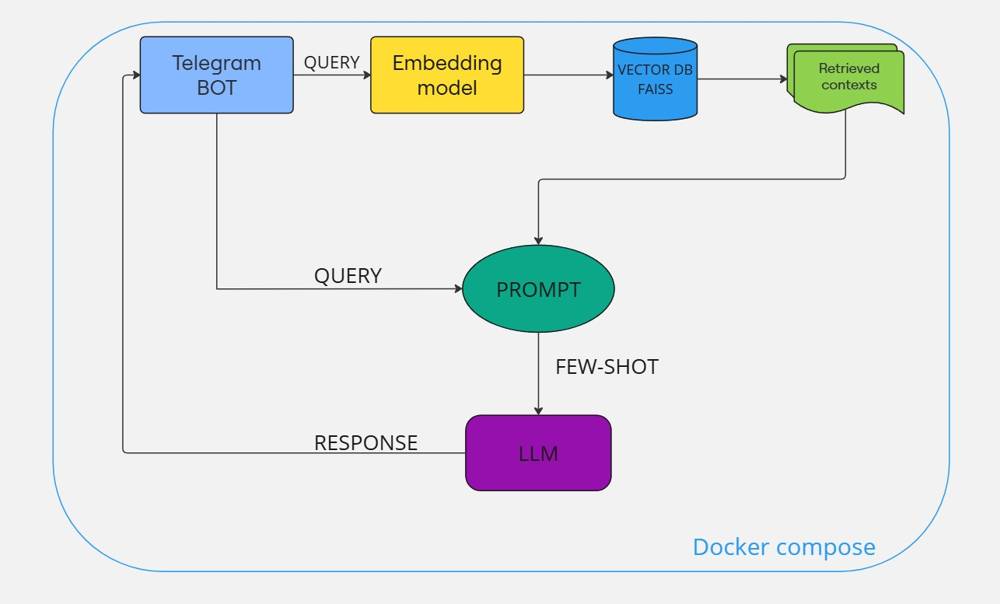

# AI Pizza Bot на основе Retrieval Augmented Generation (RAG)

AI бот для Telegram, который принимает заказы на пиццу как в текстовом, так и в голосовом формате. Этот бот использует модель Whisper для распознавания речи и LLM(Qwen) для обработки текста и формирования заказа. 

## Основные функции
- Формирование корзины заказа пиццы через текстовые сообщения.
- Формирование корзины заказа пиццы через голосовые сообщения, которые бот транскрибирует и обрабатывает.

## Архитектура сервсиа:



Работа сервиса основана на Retrieval Augmented Generation (RAG). При запуске сервиса загружается датасет `formatted_data.json`, который содержит примеры для few-shot промптинга.
На его основе создаётся векторная база данных (FAISS) с помощью модели для эмбеддингов, и подключается `retriever`.

При каждом запросе пользователя происходит следующее:
1. **Запрос** поступает в `retriever`.
2. **Подбор контекста**: Из векторной базы данных (FAISS) выбираются примеры, похожие на запрос пользователя, которые передаются в промпт для LLM.
3. **Генерация ответа**: LLM формирует ответ, основываясь на переданном контексте и few-shot примерах, и возвращает пользователю готовую корзину заказа.


## Используемые модели:
- **Embedding-модель**: Используется для создания векторного представления данных и формирования базы данных. Модель — [LaBSE-ru-turbo](https://huggingface.co/sergeyzh/LaBSE-ru-turbo).
- **Speech Recognition (Распознавание речи)**: Модель из Hugging Face для преобразования речи в текст — [whisper-large-v3-russian](https://huggingface.co/antony66/whisper-large-v3-russian).
- **LLM-модель**: для возврата корзины заказа используется  [Qwen2.5-72B-Instruct](https://huggingface.co/Qwen/Qwen2.5-72B-Instruct). 

## Демонстрация работы сервиса
[](https://www.youtube.com/watch?v=xEU5VpRfEIs)


## Запуск сервиса

1. **Склонируйте репозиторий:**
   ```bash
   git clone https://github.com/Shoxiing/get_pizza
   cd get_pizza

2. **Запустите docker-compose файл:**
   ```bash
   docker-compose up --build
